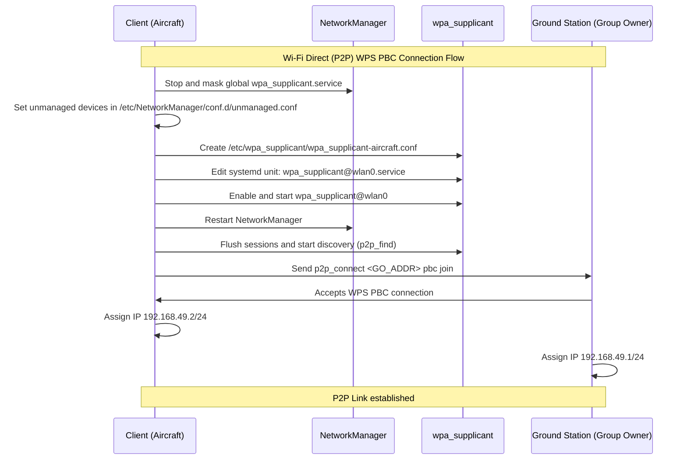
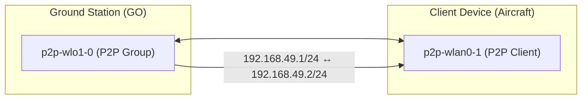

# Wi-Fi Direct (P2P) Connection Guide  
**for Client Device (Aircraft / Drone)**

---

## 🗂 Overview

This document describes how to configure the **Client side** of a Wi-Fi Direct (P2P) connection to link with a **Ground Station (Group Owner)**.  
It uses `wpa_supplicant` and `NetworkManager` for manual peer discovery and WPS PBC join operations.

---

## 📶 P2P Connection Flow



---

## 🧭 Step-by-Step Setup

### 1️⃣ Disable global wpa_supplicant and set unmanaged interfaces

```bash
sudo systemctl stop wpa_supplicant.service
sudo systemctl mask wpa_supplicant.service

echo "[keyfile]
unmanaged-devices=interface-name:wlan*;interface-name:p2p-*" | sudo tee /etc/NetworkManager/conf.d/unmanaged.conf
```

---

### 2️⃣ Create Aircraft configuration file

```bash
echo 'ctrl_interface=DIR=/var/run/wpa_supplicant GROUP=netdev
update_config=1
p2p_go_intent=0
device_name=Aircraft
device_type=1-0050F204-1
config_methods=virtual_push_button physical_display keypad' | sudo tee /etc/wpa_supplicant/wpa_supplicant-aircraft.conf
```

---

### 3️⃣ Enable and edit wpa_supplicant service

```bash
sudo systemctl enable wpa_supplicant@wlan0.service
sudo systemctl edit wpa_supplicant@wlan0.service
```

```ini
[Service]
ExecStart=
ExecStart=/usr/sbin/wpa_supplicant -Dnl80211 -iwlan0 -c/etc/wpa_supplicant/wpa_supplicant-aircraft.conf
```

Then reload and enable:

```bash
sudo systemctl daemon-reload
sudo systemctl enable --now wpa_supplicant@wlan0.service
sudo systemctl restart NetworkManager
```

---

### 4️⃣ Check service status

```bash
sudo systemctl status NetworkManager
sudo systemctl status wpa_supplicant.service
sudo systemctl status wpa_supplicant@wlan0.service
```

---

### 5️⃣ Discover and connect to Group Owner

```bash
sudo wpa_cli -i wlan0 p2p_flush
sudo wpa_cli -i wlan0 p2p_find
sudo wpa_cli -i wlan0 p2p_peers

sudo wpa_cli -i wlan0 p2p_connect bc:09:1b:1d:15:92 pbc join
```

(Replace `bc:09:1b:1d:15:92` with your Ground Station’s MAC address.)

---

### 6️⃣ Verify connection with Group Owner

```bash
iw dev $(basename /sys/class/net/p2p-wlan0-*) info 2>/dev/null
sudo wpa_cli -i "$(basename /sys/class/net/p2p-wlan0-*)" status 2>/dev/null
ip addr show $(ls /sys/class/net/ | grep ^p2p-wlan0-)
```

```bash
iw dev $(basename /sys/class/net/p2p-wlan0-*) station dump
sudo wpa_cli -i wlan0 p2p_peer bc:09:1b:1d:15:92
```

---

### 7️⃣ Assign IP address

```bash
sudo ip addr add 192.168.49.2/24 dev p2p-wlan0-1
```

---

### 8️⃣ Monitor logs

```bash
sudo journalctl -u wpa_supplicant@wlan0 -f
```

---

## 🧩 Example Network Topology



---

## 📜 License

MIT © 2025 FPV Japan / Aircraft P2P Project
