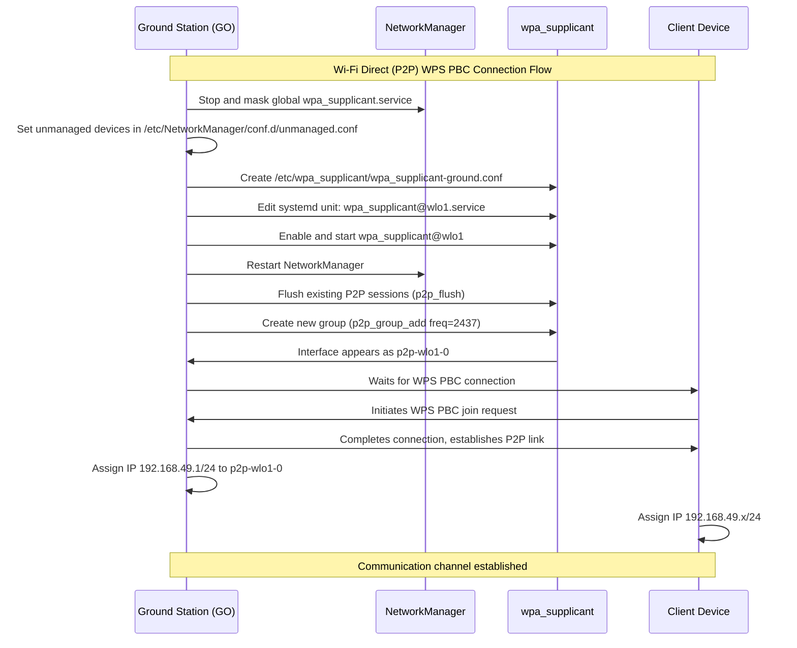
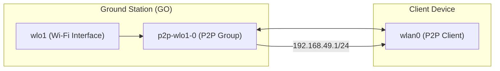

# Wi-Fi Direct (P2P) Connection Guide  
**for Ground Station (Group Owner)**

---

## 🗂 Overview

This document explains how to establish a **Wi-Fi Direct (P2P)** link between a **Ground Station (Group Owner)** and a **Client (Drone / Device)**.  
The setup uses `wpa_supplicant` and `NetworkManager` on Linux.

---

## 📶 P2P Connection Flow



---

## 🧭 Step-by-Step Setup

### 1️⃣ Disable global wpa_supplicant and configure unmanaged interfaces

```bash
sudo systemctl stop wpa_supplicant.service
sudo systemctl mask wpa_supplicant.service

echo "[keyfile]
unmanaged-devices=interface-name:wlo*;interface-name:p2p-*" | sudo tee /etc/NetworkManager/conf.d/unmanaged.conf
```

---

### 2️⃣ Create Ground Station wpa_supplicant config

```bash
echo "ctrl_interface=DIR=/var/run/wpa_supplicant GROUP=netdev
update_config=1
device_name=GroundStation
device_type=1-0050F204-1
config_methods=virtual_push_button physical_display keypad" | sudo tee /etc/wpa_supplicant/wpa_supplicant-ground.conf
```

---

### 3️⃣ Edit and enable service unit

```bash
sudo systemctl edit wpa_supplicant@wlo1.service
```

```ini
[Service]
ExecStart=
ExecStart=/usr/sbin/wpa_supplicant -Dnl80211 -iwlo1 -c/etc/wpa_supplicant/wpa_supplicant-ground.conf
```

Then reload and enable:

```bash
sudo systemctl daemon-reload
sudo systemctl enable --now wpa_supplicant@wlo1.service
sudo systemctl restart NetworkManager
```

---

### 4️⃣ Flush any existing sessions

```bash
sudo wpa_cli -i wlo1 p2p_cancel
sudo wpa_cli -i wlo1 p2p_stop_find
sudo wpa_cli -i wlo1 p2p_flush
sudo pkill -f wpa_supplicant
sudo ip link set wlo1 down
sudo ip link set wlo1 up
sudo systemctl restart wpa_supplicant@wlo1
```

---

### 5️⃣ Start Group Owner (GO)

```bash
sudo wpa_cli -i wlo1 p2p_group_add freq=2437
```

Check the P2P interface:

```bash
iw dev $(basename /sys/class/net/p2p-wlo1-*) info
sudo wpa_cli -i "$(basename /sys/class/net/p2p-wlo1-*)" status
ip addr show $(ls /sys/class/net/ | grep ^p2p-wlo1-)
```

---

### 6️⃣ Accept client connection

```bash
sudo wpa_cli -p /var/run/wpa_supplicant -i p2p-wlo1-0 wps_pbc
```

---

### 7️⃣ Verify connection

```bash
iw dev $(basename /sys/class/net/p2p-wlo1-*) station dump
sudo wpa_cli -i wlo1 p2p_peer da:3a:dd:09:24:2a
```

---

### 8️⃣ Assign IP address to GO

```bash
sudo ip addr add 192.168.49.1/24 dev p2p-wlo1-0
```

---

### 9️⃣ Monitor logs

```bash
sudo journalctl -u wpa_supplicant@wlo1 -f
```

---

## 🧩 Example Network Topology



---

## 📜 License

MIT © 2025 FPV Japan / GroundStation Project
